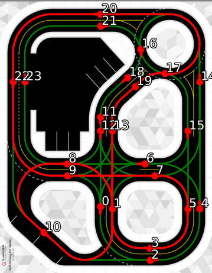
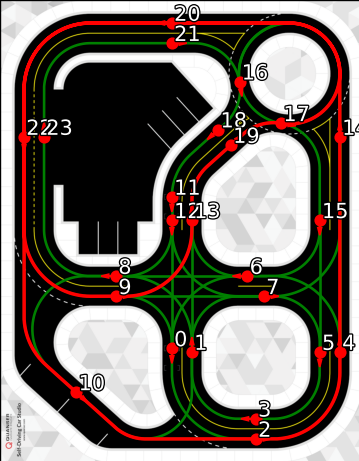

# Quanser Self-Driving Competition – ACC 2025  
## PolyCtrl v2.0: Center for Scientific Innovations and Education – National Polytechnic University of Armenia  


Welcome, Jury Members. We hope you find this README informative and helpful.


## Project Overview

This project showcases our autonomous navigation system designed for the ACC 2025 Self-Driving Competition. We implemented and evaluated two control approaches:

- **Model Predictive Contouring Control ([MPCC](https://github.com/alexliniger/MPCC.git))**
- **PID Controller with Stanley Controller**

While both controllers were tested, our primary focus was on the MPCC for its superior path-tracking performance. For perception, we used a custom-trained [YOLOv8](https://yolov8.com/) model for real-time traffic element detection, including:

- Traffic lights
- Stop signs
- Yield signs
- Roundabout signs
- Cones
- Pedestrians

We also implemented a custom path planning module based on the D* algorithm to compute optimal, time-aware paths that respect traffic signals and static/dynamic obstacles.

Additionally, the system manages pick-up and drop-off points using the TF framework to ensure full stops and completion of a ride cycle. Once the ride ends, the vehicle returns to the taxi hub.

## Hardware & Software Requirements

- **Operating System:** Ubuntu 24.04  
- **GPU:** NVIDIA (RTX 3060 or higher recommended)  
- **ROS 2:** Humble (via Docker container)  
- **Python Versions:**  
  - Host system: Python 3.11.4  
  - Docker container: Python 3.8.10  


## Algorithm Behavior

The algorithm follows this flow:

- Navigate from the start point to pick-up: `[0.125, 4.395]`
  - Change LED strip to **cyan** (configuration 2)
- Proceed from pick-up to drop-off: `[-0.905, 0.800]`
  - Maintain **cyan** LED (configuration 2)
- **Stop Sign:** Pause for 3 seconds, LED turns **red** (configuration 0)
- **Red Traffic Light:** Wait, LED turns **yellow** (configuration 3)
- **Roundabouts:** Use blinkers (left/right) to indicate exit direction
- **Lane Following:** Stay centered between the lanes
- **Obstacle Avoidance:** MPCC generates a temporary alternate path, then resumes original route while obeying all traffic rules


## Path Planning: A* vs. D*

Initially, we used A* to compute paths based on provided waypoints and time-based weights:

- Stop sign: 3 seconds  
- Traffic light: 7 seconds  
- Pick-up/drop-off: 3 seconds  

While A* provides fast pathfinding, it falls short when optimizing for time. Therefore, we implemented the **D\*** algorithm, which dynamically updates based on environmental weights, yielding more efficient results in real-time.

### Visual Comparison

<p align="center">
  
  
</p>

<p align="center">
  <strong>Figure 1:</strong> Path generated using the A* algorithm.  
  <strong>Figure 2:</strong> Path generated using the D* algorithm.
</p>


## Setup Instructions
**IMPORTANT**: Due to mismatches in the LiDAR configurations, we have made some changes in `qcar2_nodes`. For this reason, it is important to clone the entire repository.
1. **Follow official software setup guide:**  
   [ACC 2025 Software Setup Instructions](https://github.com/quanser/ACC-Competition-2025/blob/main/Software_Guides/ACC%20Software%20Setup%20Instructions.md)

2. **In Terminal 1, clone and move the repository:**
   ```bash
   git clone https://github.com/csie-foundation/ACC2025_Quanser_Student_Competition.git
   mv ACC2025_Quanser_Student_Competition/Setup_Real_Scenario_Interleaved.py /home/$USER/Documents/ACC_Development/docker/virtual_qcar2/python/Base_Scenarios_Python/
   rm -rf /home/$USER/Documents/ACC_Development/Development/ros2/src/*
   mv -f ACC2025_Quanser_Student_Competition/* /home/$USER/Documents/ACC_Development/Development/ros2/src/

   ```

3. **Start Docker and install dependencies:**

   ```bash
   docker start isaac_ros_dev-x86_64-container
   docker exec -it isaac_ros_dev-x86_64-container bash
   cd /workspaces/isaac_ros-dev/ros2/src/polyctrl
   sudo apt update
   sudo apt install ros-humble-tf-transformations
   pip3 install -r requirements.txt
   ```

4. **Build the ROS2 packages:**

   ```bash
   cd /workspaces/isaac_ros-dev/ros2
   colcon build --symlink-install
   source install/setup.bash
   ```


## Running the Algorithm

Open multiple terminals and execute the following:

### Terminal 2 (`virtual_qcar2` container)

Spawn the virtual environment with obstacle:

   ```bash
   docker start virtual-qcar2
   docker exec -it virtual-qcar2 bash
   python3 /home/qcar2_scripts/python/Base_Scenarios_Python/Setup_Real_Scenario_Interleaved.py --with_obstacle
   ```

### Terminal 1 (`isaac_ros_dev-x86_64-container` container)

```bash
ros2 launch polyctrl run_sim.launch.py
```

### Terminal 3 (`isaac_ros_dev-x86_64-container` container)

```bash
docker exec -it isaac_ros_dev-x86_64-container bash
source /workspaces/isaac_ros-dev/ros2/install/setup.bash
ros2 run polyctrl Detection_node
```

### Terminal 4 (`isaac_ros_dev-x86_64-container` container) – Choose one:

```bash
docker exec -it isaac_ros_dev-x86_64-container bash
source /workspaces/isaac_ros-dev/ros2/install/setup.bash
ros2 run polyctrl MPC_node --with_obstacle #Runs MPCC with an obstacle avoidance constraint
ros2 run polyctrl MPC_node #Runs MPCC with no obstacle avoidance constraint
ros2 run polyctrl PID_node #Runs PID with no obstacle avoidance
```

## Results

Watch our simulation results on [YouTube](https://youtube.com).


## Support

If you encounter any issues or have questions, feel free to open an [Issue](https://github.com/csie-foundation/ACC2025_Quanser_Student_Competition/issues) or start a [Discussion](https://github.com/csie-foundation/ACC2025_Quanser_Student_Competition/discussions).


Thank you for your time and evaluation!


